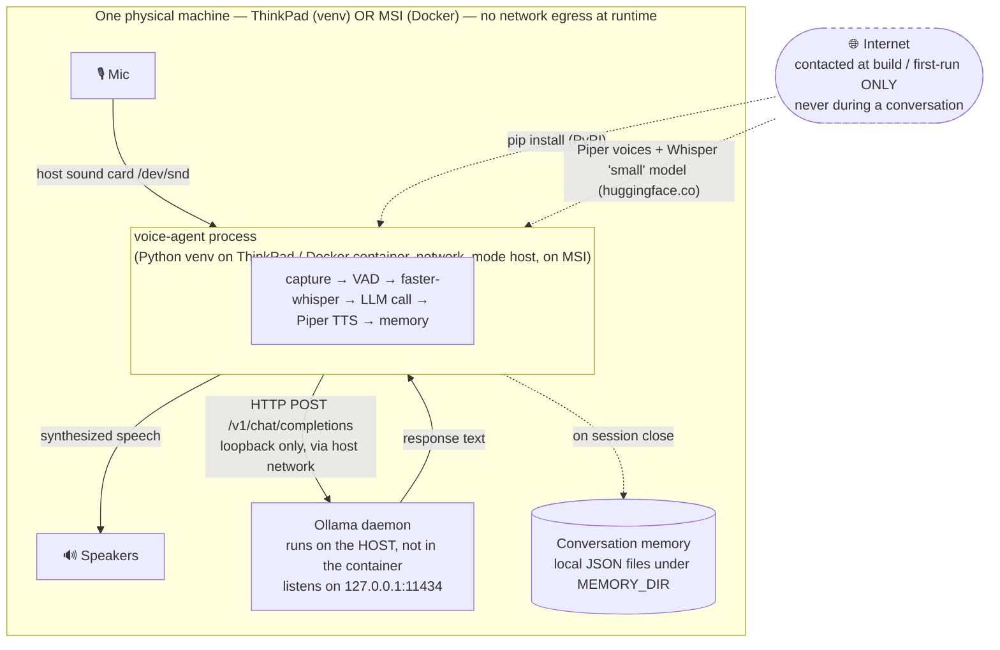
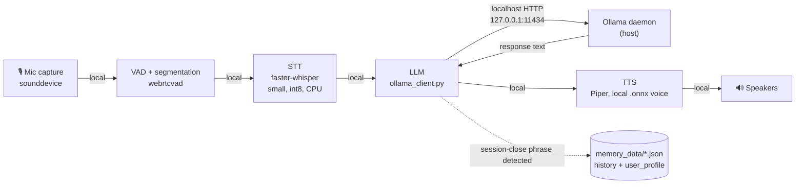
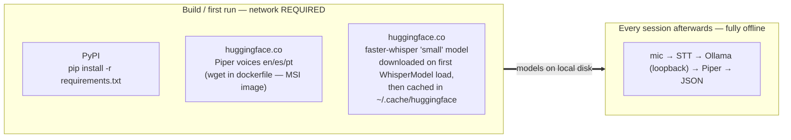
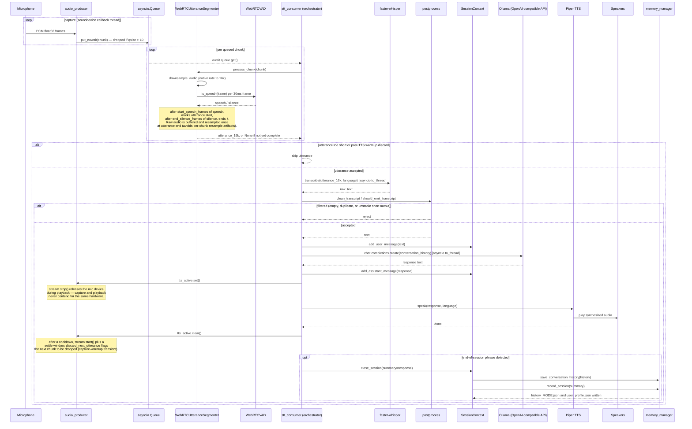
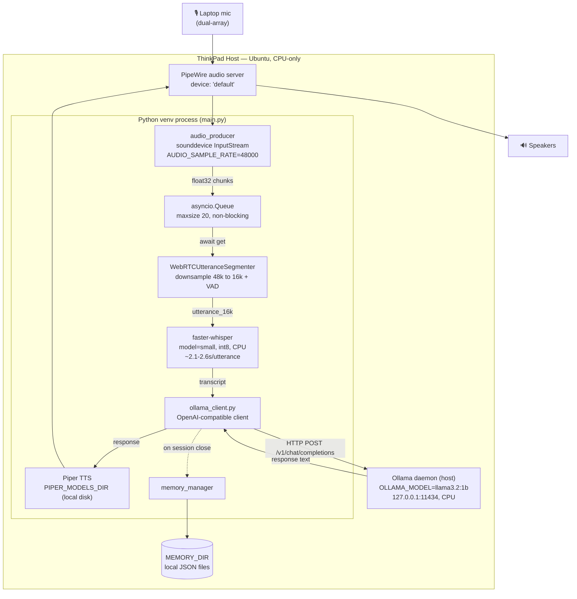
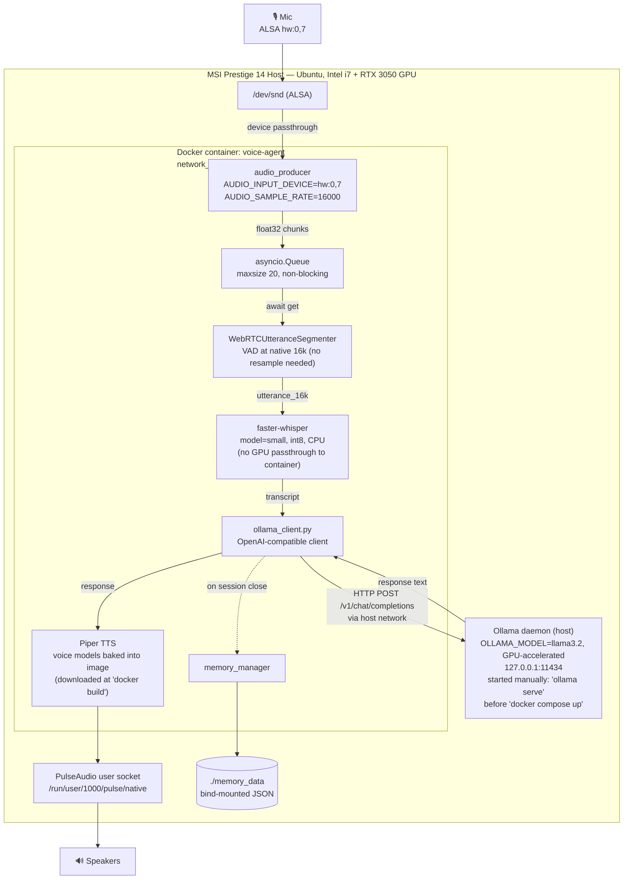

# Voice Agent — Architecture & Sequence Diagrams

Grounded directly in the current code (`app/`, `main.py`, `docker-compose.yaml`, `dockerfile`, `CLAUDE.md`) as of 2026-08-30.

> **Note on stale docs:** `docs/architecture.md` and `.env.example` describe an older version of this project (ElevenLabs cloud TTS, raw OpenAI Whisper, `OPENAI_API_BASE`, Llama2). The current code path uses **Piper TTS** (`app/tts/piper_tts.py`), **faster-whisper** (`app/stt/whisper.py`), and talks to **Ollama** via `OLLAMA_BASE_URL` / `OLLAMA_MODEL` (`app/llm/ollama_client.py`). The diagrams below reflect the code as it actually runs today, not those older docs.

> **Reading order:** sections 1–3 are the high-level "where does this run and what leaves the machine" view. Sections 4–6 are the detailed per-utterance and per-machine views.

---

## 1. Network Boundary & Deployment Locality (high-level)

"Docker" here is **a container on your own laptop**, not a remote host and not a cloud VM. There is **no external server** in the runtime path. `docker-compose.yaml` uses `network_mode: "host"`, so the container shares the laptop's own network stack — `127.0.0.1` inside the container *is* the host's `127.0.0.1`. That is the entire reason the container can reach an Ollama daemon that runs **on the host, outside the container**.

> **The `.env` file is misleading — those keys are dead weight.** `OPENAI_API_KEY=foo`, `OPENAI_API_BASE`, `ELEVENLABS_API_KEY`, `ELEVENLABS_VOICE_ID` are all leftovers from the old design. The `openai` package *is* installed, but `app/llm/ollama_client.py` uses it only as a generic OpenAI-compatible HTTP client with `api_key="ollama"` hardcoded and `base_url` pointed at local Ollama — it never calls `api.openai.com`. `elevenlabs` is in `requirements.txt` but is **not imported anywhere** in `app/`; TTS is entirely local Piper. No credential in `.env` authenticates to any external service during a session.

---

## 2. Runtime Data Flow — per conversation turn (high-level)

Every stage runs locally. The only inter-process hop is a loopback HTTP call to Ollama on the same machine.

| Stage | Runs where | Leaves the machine? |
|---|---|---|
| Mic capture (`app/audio/input.py`, `sounddevice`) | app → host sound card (`/dev/snd`) | No |
| VAD + utterance segmentation (`app/stt/vad.py`, `segmenter.py`) | app, CPU | No |
| STT — `faster-whisper` `small` int8 (`app/stt/whisper.py`) | app, CPU on **both** machines | No — model already on local disk |
| LLM — `app/llm/ollama_client.py` | HTTP POST to `127.0.0.1:11434/v1` → Ollama daemon on host | No — loopback only |
| TTS — Piper `.onnx` voices (`app/tts/piper_tts.py`) | app, local model files | No |
| Memory — `app/memory/memory_manager.py` | writes `history_<mode>.json` + `user_profile.json` under `MEMORY_DIR` | No — local file (bind-mounted to the project dir on MSI) |

Your voice audio, transcripts, and conversation history never leave the laptop. On MSI they land in `./memory_data/` via the `./memory_data:/app/memory_data` bind mount (that directory is currently owned by `root` because the container created it).

---

## 3. Build-time vs Runtime network access

The internet is required **only** to build the image and to fetch models the first time. After that, a session works fully offline.

| When | What it fetches | Where from | Notes |
|---|---|---|---|
| `docker compose up --build` | Python dependencies | PyPI | `dockerfile` `pip install` step |
| `docker compose up --build` | Piper voice models (`en_US-ryan-high`, `es_ES-davefx-medium`, `pt_BR-faber-medium`) | `huggingface.co/rhasspy/piper-voices` | `wget` in `dockerfile`; baked into the MSI image. On ThinkPad these are provisioned manually under `PIPER_MODELS_DIR`. |
| First `WhisperModel("small")` load | faster-whisper `small` int8 weights | HuggingFace Hub | Happens on first *run*, not build; cached afterwards. Applies to both machines. |
| Every session after that | nothing | — | Pull the network cable and it still works. |

---

## 4. Pipeline Sequence Diagram (shared — identical code path on both machines)

The per-utterance call sequence in `app/pipeline/orchestrator_async.py` is the same on both machines; only environment values differ (see the parameter table below). This is one diagram covering both deployments.

### Per-machine parameters (same code, different environment)

| Parameter | ThinkPad | MSI |
|---|---|---|
| `AUDIO_INPUT_DEVICE` | `default` (via PipeWire) | `hw:0,7` (raw ALSA) |
| `AUDIO_SAMPLE_RATE` | `48000` | `16000` |
| `OLLAMA_MODEL` | `llama3.2:1b` | `llama3.2` (full size, GPU) |
| Whisper compute | CPU, ~2.1–2.6s/utterance | CPU (no GPU passed to container) |
| Deployment | Python venv, direct on host | Docker container, `network_mode: host` |

---

## 5. ThinkPad Architecture

CPU-only, no Docker — the Python process runs directly on the host under PipeWire.

**ThinkPad-specific note:** raw ALSA capture gain defaults to +30dB, which clips speech and stops VAD from ever detecting silence. Requires a per-boot fix: `amixer -c 0 sset Capture 70%`. Not represented as a pipeline node above since it's a one-time host setup step, not part of the runtime data flow.

---

## 6. MSI Architecture

Docker container + GPU host. Ollama runs on the **host**, not in the container.

**MSI-specific note:** the container gets no GPU device reservation in `docker-compose.yaml` — only `/dev/snd` is passed through. The GPU acceleration applies to the host's Ollama daemon only; `faster-whisper` inside the container still runs on CPU, same as on the ThinkPad.

---

## Structural assumptions made

- `app/core/context.py` currently defines `SessionContext` twice (the file has two full class definitions back-to-back); Python resolves this to the second, later definition, which is the one shown feeding into memory load/save above. This looks like leftover duplication in the source, not an intentional two-phase design — flagging here rather than silently picking one without comment.
- The `.env` / `.env.example` files in the repo still reference the old ElevenLabs/OpenAI-direct integration and don't reflect `OLLAMA_BASE_URL`, `OLLAMA_MODEL`, `AUDIO_INPUT_DEVICE`, etc. that the code actually reads — those variable names and their per-machine values are taken from `CLAUDE.md` and `docker-compose.yaml` instead.
